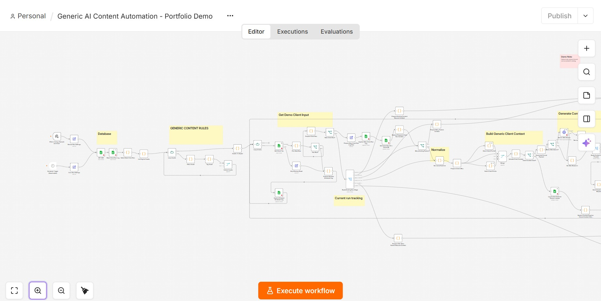
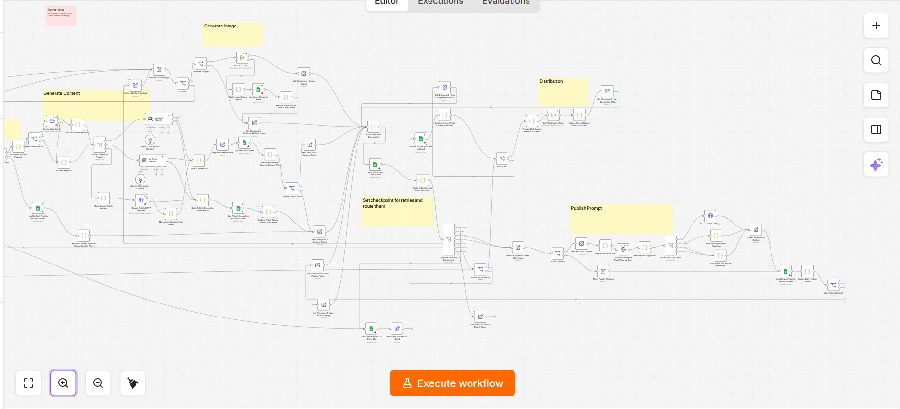

# AI Content Automation Workflow — n8n

A portfolio demonstration of a multi-stage AI automation workflow built with **n8n**.

The workflow coordinates AI content generation, optional web research, structured output validation, image generation, WordPress publishing, downstream distribution, and checkpoint-based recovery across multiple AI providers and external services.

## Workflow Overview

The workflow is divided into several stages covering input and scheduling, runtime configuration, AI generation, validation, publishing, distribution, and failure recovery.

### Input, Configuration & AI Generation



This section handles:

- Manual and scheduled workflow execution
- Runtime configuration
- Job and content selection
- Client/context preparation
- Optional web research
- AI provider selection
- Content generation
- Structured output processing

### Publishing, Distribution & Recovery



This section handles:

- Output validation
- Optional image generation
- Publishing preparation
- WordPress REST API publishing
- Distribution workflows
- Execution checkpoints
- Retry handling
- Failure logging and recovery

## Features

- **Multi-provider LLM routing**
  - OpenAI
  - Google Gemini
  - Anthropic Claude

- **AI content generation**
  - Runtime-configurable models
  - Context-aware prompt construction
  - Structured HTML output
  - SEO metadata extraction and validation

- **Optional web research**
  - Conditional research branch
  - Google Search-grounded Gemini requests
  - Research-source extraction
  - Research context passed into generation

- **Workflow orchestration**
  - Manual execution
  - Scheduled execution
  - Conditional routing
  - Nested/sub-workflow execution
  - Runtime configuration

- **State and data management**
  - Google Sheets integration
  - Job selection and status tracking
  - Runtime state management
  - Run logging

- **Publishing automation**
  - WordPress REST API integration
  - Post/page creation
  - Metadata handling
  - Featured-image support
  - Publishing status tracking

- **Reliability and recovery**
  - Retry logic
  - Error handling
  - Checkpoint-based execution
  - Resume/recovery paths
  - Failed-publish retry handling
  - Image-generation failure fallback

- **Distribution**
  - Conditional downstream distribution
  - Distribution subworkflow support
  - Post-publication routing

## High-Level Architecture

```text
Manual / Scheduled Trigger
          ↓
    Runtime Settings
          ↓
     Job Selection
          ↓
  Context Preparation
          ↓
 Optional Web Research
          ↓
   LLM Provider Router
     ↙      ↓      ↘
 OpenAI   Gemini   Claude
     ↘      ↓      ↙
    Content Generation
          ↓
   Output Validation
          ↓
 Optional Image Generation
          ↓
   Publishing Preparation
          ↓
   WordPress REST API
          ↓
      Distribution
          ↓
 Checkpoints / Logging
          ↓
 Retry / Recovery Handling
```

## Technologies

- **n8n**
- **JavaScript**
- **OpenAI API**
- **Google Gemini API**
- **Anthropic Claude API**
- **Google Sheets**
- **WordPress REST API**
- **HTTP / REST APIs**
- **LLM workflow orchestration**
- **Conditional workflow routing**
- **Structured data processing**

## Multi-Provider AI Routing

The workflow can route content-generation requests between multiple AI providers based on runtime configuration.

Supported providers in the demo architecture include:

```text
OpenAI
Google Gemini
Anthropic Claude
```

This allows the workflow architecture to remain provider-independent while supporting different models for different execution requirements.

## Reliability Design

The workflow includes reliability mechanisms beyond a simple linear automation pipeline.

Examples include:

- execution checkpoints
- recoverable workflow stages
- retry handling
- failed-publish recovery
- client-context validation
- content-generation failure handling
- image-generation failure fallback
- publishing status tracking
- run-state tracking

These mechanisms allow interrupted or partially failed runs to resume from appropriate stages rather than restarting the entire workflow.

## Workflow File

The importable n8n workflow is included in this repository:

[`workflow.json`](workflow.json)

## Setup

To experiment with the workflow:

1. Install or access an n8n instance.
2. Import `workflow.json`.
3. Configure your own Google Sheets credentials.
4. Configure whichever AI providers you want to use:
   - OpenAI
   - Google Gemini
   - Anthropic Claude
5. Replace:

   ```text
   REPLACE_WITH_GOOGLE_SHEET_ID
   ```

   with your own Google Sheet ID.

6. If using the optional image-generation branch, replace:

   ```text
   REPLACE_WITH_IMAGE_WORKFLOW_ID
   ```

   with your own n8n subworkflow ID.

7. If using the distribution branch, replace:

   ```text
   REPLACE_WITH_DISTRIBUTION_WORKFLOW_ID
   ```

   with your own n8n subworkflow ID.

8. Configure a test WordPress environment if you want to test publishing.

9. Review all workflow configuration before enabling scheduled execution.

## Portfolio Version

This repository contains a **generic portfolio demonstration** based on workflow automation concepts used in professional software-development work.

The public version has been modified to remove or replace:

- company-specific information
- client information
- credentials
- credential identifiers
- production database identifiers
- internal repository links
- proprietary content rules
- private configuration
- production workflow IDs

Generic placeholders and demonstration configuration are used instead.

## What This Project Demonstrates

This project demonstrates experience with:

- AI workflow orchestration
- multi-model LLM integration
- workflow automation
- REST API integrations
- JavaScript-based workflow logic
- structured data processing
- prompt and context assembly
- conditional execution
- external system integration
- automated publishing
- state management
- retries and failure recovery
- production-oriented workflow design

## Repository Structure

```text
n8n-ai-content-automation-demo/
│
├── README.md
├── workflow.json
│
└── docs/
    ├── workflow-overview-1.jpg
    └── workflow-overview-2.jpg
```

## Disclaimer

This repository is intended for **portfolio and demonstration purposes**.

Credentials and production configuration are not included. The workflow requires users to supply their own credentials, service accounts, API access, data sources, and external workflow IDs before execution.
